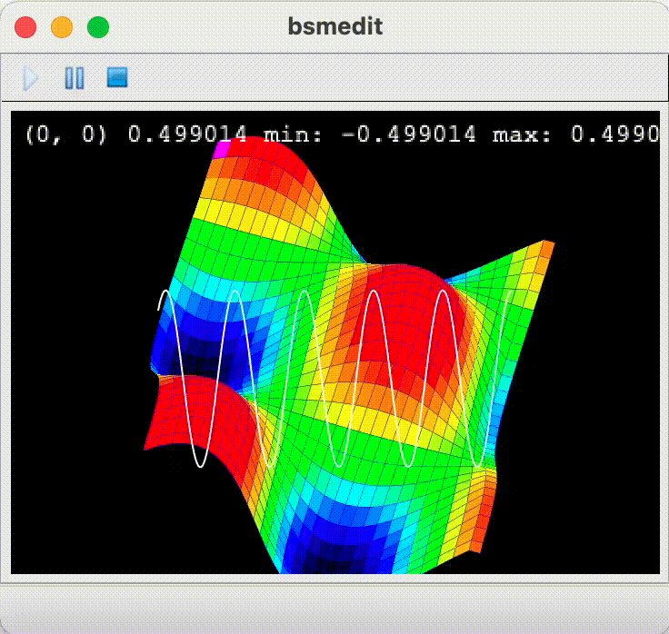

**bsmedit** is a C/C++/SystemC Visualizer:

- Control C/C++/SystemC simulation
- Monitor/visualize signals in real-time
- Visualize VCD (value change dump) files
- Visualize ulog files
- ...

To install
```
$ pip install bsmedit
```

or clone the repository and run
```
# git clone https://github.com/tianzhuqiao/bsmedit.git
$ cd bsmedit
$ pip install -e .
```

 A modified SystemC is needed to make it work with bsmedit, which can be got [here](https://github.com/tianzhuqiao/systemc).  Currently it supports the following SystemC releases
- 3.0.0_pub_rev_20231129
- 2.3.4
- 2.3.3
- 2.3.2
- 2.3.1a

Check the corresponding branch whose name starts with "**bsm-**".

The full cocumentation can be found  [here](http://bsmedit.feiyilin.com).

</img>

</img>
